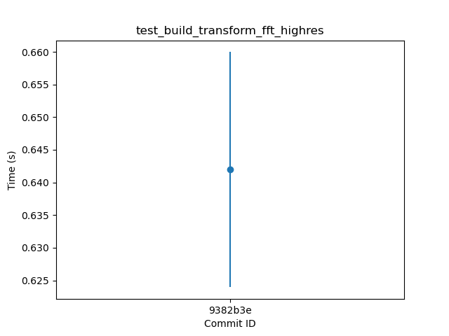
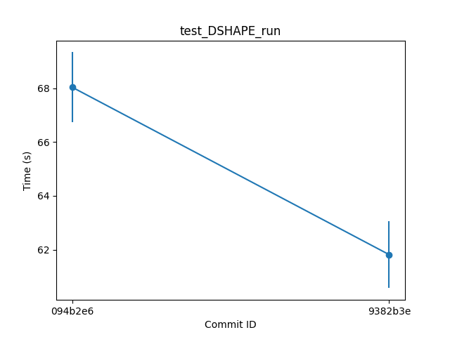

======================
Benchmark Results
======================
 
The following show the mean and standard deviation of the time to run the benchmark cases, plotted for each commit ID chronologically.

.. image:: ../tests/benchmarks/Figures/benchmark_test_build_transform_fft_midres.png
  :width: 800

.. image:: ../tests/benchmarks/Figures/benchmark_test_SOLOVEV_run.png
  :width: 800

