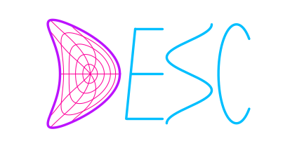

Stellarator Optimization Package
================================

DESC solves for and optimizes 3D MHD equilibria using pseudo-spectral
numerical methods and automatic differentiation.

The theoretical approach and implementation details used by DESC are
presented in the following papers and documented at [Theory](). Please
cite our work if you use DESC!

-   Dudt, D. & Kolemen, E. (2020). DESC: A Stellarator Equilibrium
    Solver. \[[Physics of Plasmas](https://doi.org/10.1063/5.0020743)\]
    \[[pdf](https://github.com/PlasmaControl/DESC/blob/master/publications/dudt2020/dudt2020desc.pdf)\]
-   Panici, D. et al (2023). The DESC Stellarator Code Suite Part I:
    Quick and accurate equilibria computations. \[[Journal of Plasma
    Physics](https://doi.org/10.1017/S0022377823000272)\]
    \[[pdf](https://github.com/PlasmaControl/DESC/blob/master/publications/panici2022/Panici_DESC_Stellarator_suite_part_I_quick_accurate_equilibria.pdf)\]
-   Conlin, R. et al. (2023). The DESC Stellarator Code Suite Part II:
    Perturbation and continuation methods. \[[Journal of Plasma
    Physics](https://doi.org/10.1017/S0022377823000399)\]
    \[[pdf](https://github.com/PlasmaControl/DESC/blob/master/publications/conlin2022/conlin2022perturbations.pdf)\]
-   Dudt, D. et al. (2023). The DESC Stellarator Code Suite Part III:
    Quasi-symmetry optimization. \[[Journal of Plasma
    Physics](https://doi.org/10.1017/S0022377823000235)\]
    \[[pdf](https://github.com/PlasmaControl/DESC/blob/master/publications/dudt2022/dudt2022optimization.pdf)\]

Quick Start
-----------

The easiest way to install DESC is from PyPI: `pip install desc-opt`

For more detailed instructions on installing DESC and its dependencies,
see [Installation]().

The best place to start learning about DESC is our tutorials:

-   [Basic fixed boundary equilibrium](): running from a VMEC input,
    creating an equilibrium from scratch
-   [Advanced equilibrium](): continuation and perturbation methods.
-   [Free boundary equilibrium](): vacuum and or finite beta with
    external field.
-   [Using DESC outputs](): analysis, plotting, saving to VMEC format.
-   [Basic optimization](): specifying objectives, fixing degrees of
    freedom.
-   [Advanced optimization](): advanced constraints, precise
    quasi-symmetry, constrained optimization.
-   [Near axis constraints](): loading solutions from QSC/QIC and fixing
    near axis expansion.
-   [Coil optimization](): \"second stage\" optimization of magnetic
    coils.

For details on the various objectives, constraints, optimizable objects
and more, see the full [api documentation]().

If all you need is an equilibrium solution, the simplest method is
through the command line by giving an input file specifying the
equilibrium and solver options, this way can also can also accept VMEC
input files.

The code is run using the syntax `desc <path/to/inputfile>` and the full
list of command line options are given in [Command Line Interface]().
(Note that you may have to prepend the command with `python -m`)

Refer to [Inputs]() for documentation on how to format the input file.

The equilibrium solution is output in a HDF5 binary file, whose format
is detailed in [Outputs]().

Repository Contents
-------------------

-   [desc]() contains the source code including the main script and
    supplemental files. Refer to the [API]() documentation for details
    on all of the available functions and classes.
-   [docs]() contains the documentation files.
-   [tests]() contains routines for automatic testing.
-   [publications]() contains PDFs of publications by the DESC group, as
    well as scripts and data to reproduce the results of these papers.

Contribute
----------

-   [Contributing
    guidelines](https://github.com/PlasmaControl/DESC/blob/master/CONTRIBUTING.rst)
-   [Issue Tracker](https://github.com/PlasmaControl/DESC/issues)
-   [Source Code](https://github.com/PlasmaControl/DESC/)
-   [Documentation](https://desc-docs.readthedocs.io/)
