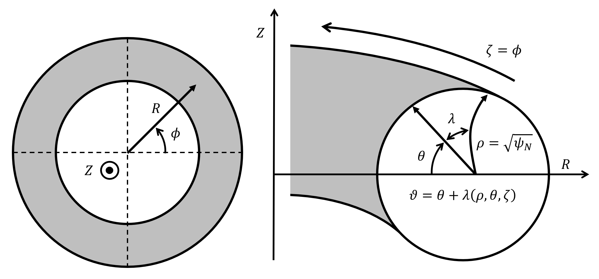

=======
General
=======

The theoretical approach and numerical methods used by DESC are explained in this publication [1]_.
The code is constantly evolving and may differ from the implementation presented in the original paper.
This documentation aims to reflect the latest version of the code, and major discrepancies from the publication will be noted when relevant.

See also our recent pre-prints on comparisons to VMEC [2]_ perturbation and continuation methods [3]_ and quasi-symmetry optimization [4]_:

.. [1] Dudt, D. & Kolemen, E. (2020). DESC: A Stellarator Equilibrium Solver. [`Physics of Plasmas <https://doi.org/10.1063/5.0020743>`__]    [`pdf <https://github.com/PlasmaControl/DESC/blob/master/publications/dudt2020/dudt2020desc.pdf>`__]
.. [2] Panici, D. et al (2022). The DESC Stellarator Code Suite Part I: Quick and accurate equilibria computations. [`JPP <https://doi.org/10.1017/S0022377823000272>`__]    [`pdf <https://github.com/PlasmaControl/DESC/blob/master/publications/panici2022/Panici_DESC_Stellarator_suite_part_I_quick_accurate_equilibria.pdf>`__]
.. [3] Conlin, R. et al. (2022). The DESC Stellarator Code Suite Part II: Perturbation and continuation methods. [`JPP <https://doi.org/10.1017/S0022377823000399>`__]    [`pdf <https://github.com/PlasmaControl/DESC/blob/master/publications/conlin2022/conlin2022perturbations.pdf>`__]
.. [4] Dudt, D. et al. (2022). The DESC Stellarator Code Suite Part III: Quasi-symmetry optimization. [`JPP <https://doi.org/10.1017/S0022377823000235>`__]    [`pdf <https://github.com/PlasmaControl/DESC/blob/master/publications/dudt2022/dudt2022optimization.pdf>`__]

Flux coordinates
****************

DESC solves the "inverse" equilibrium problem.
The computational domain is the curvilinear coordinate system :math:`(\rho, \theta, \zeta)`, where :math:`\zeta` is chosen to be the toroidal angle of the cylindrical coordinate system :math:`(R, \phi, Z)`.
These curvilinear coordinates are related to the straight field-line coordinates :math:`(\rho, \vartheta, \zeta)` through the stream function :math:`\lambda(\rho,\theta,\zeta)`.
[Note: the original publication used :math:`\zeta=-\phi` and used :math:`\vartheta` in the computational domain instead of introducing :math:`\lambda` on all flux surfaces.]
This particular choice of flux coordinates is also used by the PEST code, and should not be confused with other choices such as Boozer or Hamada coordinates.
The flux surface label :math:`\rho` is chosen to be the square root of the normalized toroidal flux :math:`\psi_N`, which is proportional to the minor radius.
This is different from the default radial coordinate in VMEC of the normalized toroidal flux.

The covariant basis vectors of the curvilinear coordinate system are

.. math::
  \mathbf{e}_\rho =  \begin{bmatrix}
      \partial_\rho R \\ 0 \\ \partial_\rho Z
  \end{bmatrix} \hspace{1cm}
  \mathbf{e}_\theta =  \begin{bmatrix}
      \partial_\theta R \\ 0 \\ \partial_\theta Z
  \end{bmatrix}\hspace{1cm}
  \mathbf{e}_\zeta =  \begin{bmatrix}
      \partial_\zeta R \\ R \\ \partial_\zeta Z
  \end{bmatrix}

and the Jacobian of the curvilinear coordinate system is :math:`\sqrt{g} = e_\rho \cdot e_\theta \times e_\zeta`.

.. math::
  \sqrt{g} =  R \left( \cfrac{\partial R}{\partial \rho}  \cfrac{\partial Z}{\partial \theta} + \cfrac{\partial R}{\partial \theta}  \cfrac{\partial Z}{\partial \rho} \right)

DESC solves for the map between the cylindrical and flux coordinate systems through the following variables that represent the shapes of the flux surfaces:

.. math::
  R(\rho, \theta, \zeta) \\[.2cm]
  Z(\rho, \theta, \zeta) \\[.2cm]
  \lambda(\rho, \theta, \zeta)

It assumes the flux functions for the pressure profile :math:`p(\rho)` and either the rotational transform :math:`\iota(\rho)` or toroidal current :math:`I(\rho)` profile are given.
Additionally, it needs the total toroidal magnetic flux through the plasma volume :math:`\Psi_a`, where :math:`\psi_N = \cfrac{\Psi}{\Psi_a}` and :math:`\psi = \cfrac{\Psi}{2\pi}`.
The shape of the last closed flux surface :math:`R^b(\theta,\phi)`, :math:`Z^b(\theta,\phi)` is also required to specify the fixed-boundary.

The poloidal angle :math:`\theta` increases clockwise so that the curvilinear coordinate system is always right-handed (:math:`\sqrt{g} > 0`).
If boundary conditions are input with the opposite convention, DESC will internally flip the orientation to ensure a positive Jacobian.
[Note: older versions of the code did not check the input orientation and allowed solutions with a negative Jacobian.]

Magnetic Field & Current Density
********************************

By assuming nested flux surfaces, :math:`\mathbf{B} \cdot \nabla \rho = 0`, and invoking Gauss's Law, :math:`\nabla \cdot \mathbf{B} = 0`, the magnetic field is written in flux coordinates as

.. math::
  \begin{aligned}
    \mathbf{B} &= B^\theta \mathbf{e}_\theta + B^\zeta \mathbf{e}_\zeta \\[.3cm]
    &= \frac{\partial_\rho \psi}{2 \pi \sqrt{g}} \left((\iota - \cfrac{\partial \lambda}{\partial \zeta}) \mathbf{e}_\theta + (1 + \cfrac{\partial \lambda}{\partial \theta}) \mathbf{e}_\zeta \right)
  \end{aligned}

So,

.. math::
  \begin{aligned}
    B^\rho &= 0 \\[.2cm]
    B^\theta &= \frac{\partial_\rho \psi}{2 \pi \sqrt{g}} \left(\iota - \cfrac{\partial \lambda}{\partial \zeta}\right)\\[.2cm]
    B^\zeta &= \frac{\partial_\rho \psi}{2 \pi \sqrt{g}} \left(1 + \cfrac{\partial \lambda}{\partial \theta}\right)
  \end{aligned}

The current density is then calculated from Ampere's Law, :math:`\nabla \times \mathbf{B} = \mu_0 \mathbf{J}`,

.. math::
  \begin{aligned}
  J^\rho &= \frac{\partial_\theta B_\zeta - \partial_\zeta B_\theta}{\mu_0 \sqrt{g}} \\[.2cm]
  J^\theta &= \frac{\partial_\zeta B_\rho - \partial_\rho B_\zeta}{\mu_0 \sqrt{g}} \\[.2cm]
  J^\zeta &= \frac{\partial_\rho B_\theta - \partial_\theta B_\rho}{\mu_0 \sqrt{g}}
  \end{aligned}

where :math:`B_i = \mathbf{B} \cdot \mathbf{e}_i`.
This allows the magnetic field and current density to be computed from the independent variables and inputs:

.. math::
  \begin{aligned}
  \mathbf{B}(\rho, \theta, \zeta) &= \mathbf{B}(R(\rho, \theta, \zeta), Z(\rho, \theta, \zeta), \lambda(\rho, \theta, \zeta), \iota(\rho)) \\[.2cm]
  \mathbf{J}(\rho, \theta, \zeta) &= \mathbf{J}(R(\rho, \theta, \zeta), Z(\rho, \theta, \zeta), \lambda(\rho, \theta, \zeta), \iota(\rho))
  \end{aligned}

Equilibrium Force Balance
*************************

The ideal magnetohydrodynamic equilibrium force balance is defined as

.. math::
  \mathbf{F} \equiv \mathbf{J} \times \mathbf{B} - \nabla p = \mathbf{0}

Using cross product in curvilinear coordinates, we can write

.. math::
  \mathbf{J} \times \mathbf{B} = \sqrt{g} (J^\theta B^\zeta - J^\zeta B^\theta)\mathbf{e}^\rho  \hspace{.2cm}-\hspace{.2cm}
       \sqrt{g} J^\rho (B^\zeta\mathbf{e}^\theta - B^\theta\mathbf{e}^\zeta)

When written in flux coordinates there are only two independent components:

.. math::
  \begin{aligned}
    \mathbf{F} &= F_\rho \mathbf{e}^\rho + F_{helical} \mathbf{e}^{helical} \\[.3cm]
    F_\rho &= \sqrt{g} (J^\theta B^\zeta - J^\zeta B^\theta) - \frac{\partial p}{\partial \rho} \\[.3cm]
    F_{helical} &= \sqrt{g} J^\rho \\[.3cm]
    \mathbf{e}^{helical} &= B^\zeta\mathbf{e}^\theta - B^\theta\mathbf{e}^\zeta
  \end{aligned}

where :math:`\mathbf{e}^x = \nabla x` is the contravariant basis vector of parameter x.
These forces in both the radial and helical directions must vanish in equilibrium.
DESC solves this force balance locally by evaluating the residual errors at discrete points in real space:

.. math::
  \begin{aligned}
  f_\rho &= F_\rho ||\nabla \rho|| \Delta V \\[.2cm]
  f_{helical} &= F_{helical} ||\mathbf{e}^{helical}|| \Delta V
  \end{aligned}

These equations :math:`f_\rho` and :math:`f_{helical}` represent the force errors (in Newtons) in the unit of volume :math:`\Delta V = \sqrt{g} \Delta \rho \Delta \theta \Delta \zeta` surrounding a collocation point :math:`(\rho, \theta, \zeta)`.
[Note: this definition of :math:`\mathbf{e}^{helical}` is slightly different from that of :math:`\mathbf{\beta}` given in the original paper, but the resulting equation for :math:`f_{helical}` is equivalent to the original :math:`f_\beta`.
The publication also included an additional sign term in the equations for :math:`f_\rho` and :math:`f_\beta` that has been dropped.]

In summary, the equilibrium problem is formulated as a system of nonlinear equations :math:`\mathbf{f}(\mathbf{x}, \mathbf{c}) = \mathbf{0}`.
The state vector :math:`\mathbf{x}` contains the spectral coefficients representing the independent variables:

.. math::
  \mathbf{x} =  \begin{bmatrix}
      R_{lmn} \\ Z_{lmn} \\ \lambda_{lmn}
  \end{bmatrix}

The parameter vector :math:`\mathbf{c}` contains the spectral coefficients of the inputs that define a unique equilibrium solution:

.. math::
  \mathbf{c} =  \begin{bmatrix}
      R^b_{mn} \\ Z^b_{mn} \\ p_l \\ \iota_l \\ \psi_a
  \end{bmatrix}

The equations :math:`\mathbf{f}` are the force error residuals at a series of collocation points:

.. math::
  \mathbf{f} =  \begin{bmatrix}
      f_\rho \\ f_{helical}
  \end{bmatrix}

DESC allows flexibility in the choice of optimization algorithm used to solve this system of equations; popular approaches include Newton-Raphson methods and least-squares minimization (as the collocation grids are often oversampled, which has been found to improve convergence and robustness).
