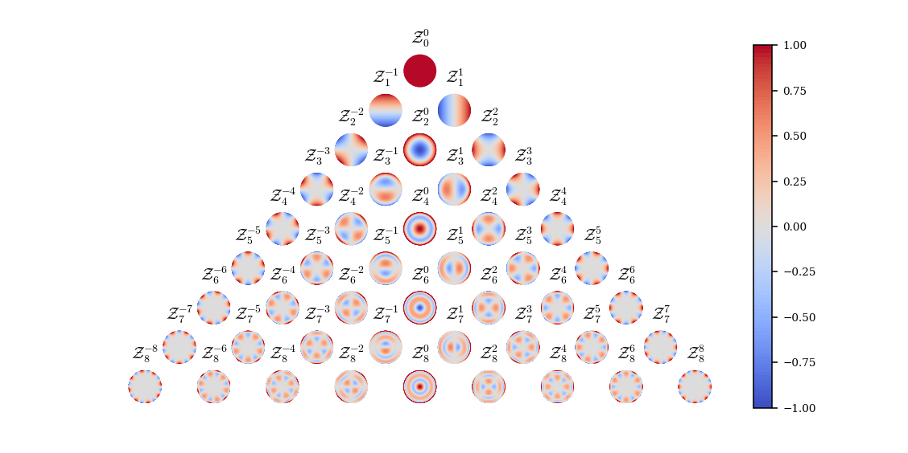
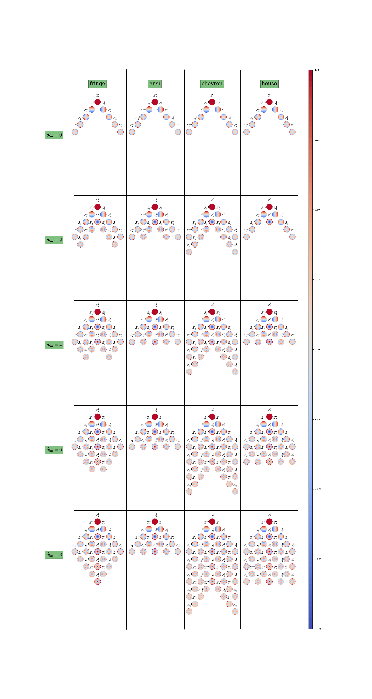

.. _theory_zernike_indexing:

Zernike Indexing
================

The Zernike polynomials are set of 2D basis functions on the unit disc, denoted commonly by :math:`Z_l^m`. They are indexed by 2 variables, :math:`l` is the radial mode number and :math:`m` is the poloidal mode number. 

The input parameter ``M`` in the DESC :ref:`input_file` governs the maximum poloidal resolution, with :math:`m \in [-M,-M+1,...,M-1, M ]`. Because of the nature of the Zernike polynomials, the radial resolution is inherently coupled to the poloidal resolution, so they cannot be specified completely independently. Instead, the integer parameter ``delta_lm`` along with the string ``zern_mode`` controls how the radial resolution relates to the poloidal resolution.

The indexing of the Zernike polynomials can be visualized as a pyramid, with the vertical direction corresponding to increasing radial resolution, and the horizontal direction to increasing poloidal resolution, as shown below:

    "Pyramid" of Zernike polynomials

All indexing schemes are the same for ``delta_lm = 0``, beginning with a chevron of width ``2*M`` along the outer edge of the pyramid containing the :math:`l = \pm m` modes.
The different indexing schemes control how the pyramid is filled in for a given value of ``M`` and ``delta_lm``:

- ``fringe``  fills in by adding additional chevrons, decreasing the width by 2 each time, increasing the maximum radial resolution but including only 1 mode at the maximum poloidal resolution of :math:`\pm M`, and finally forming a diamond shaped pattern when ``delta_lm = 2*M``. Increasing ``delta_lm`` beyond this point has no effect. If not specified, ``delta_lm`` defaults to ``2*M``, giving a diamond shape. Also known as "University of Arizona" indexing
- ``ansi`` fills in with chevrons that decrease in width by 4 each time, and finally forming a pyramid shape for ``delta_lm = M``. Increasing ``delta_lm`` greater than ``M`` has no effect. If not specified, the parameter ``delta_lm`` defaults to ``M``, giving a pyramid shape.
- ``chevron`` fills in by adding chevrons of constant width, thus giving more modes at the maximum poloidal resolution. If not specified, the parameter ``delta_lm`` defaults to ``M``, giving a stacked chevron shape.
- ``house`` behaves like ``ansi``, but increasing ``delta_lm`` adds new modes like levels on a house (adding all modes of a given :math:`l` at a time). If not specified, the parameter ``delta_lm`` defaults to ``2*M``, giving a "house" like shape, hence the name.

This behavior is summarized in the figure below, showing the basis functions used for ``M = 4`` for the different indexing schemes and different values of ``delta_lm``

    Different indexing schemes for Zernike polynomials
