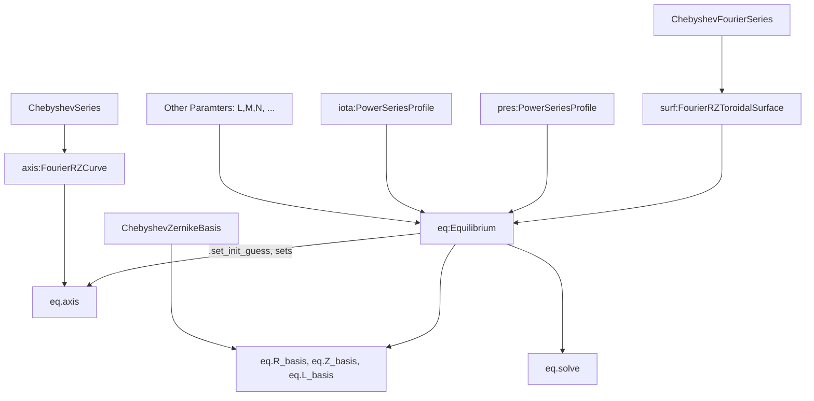
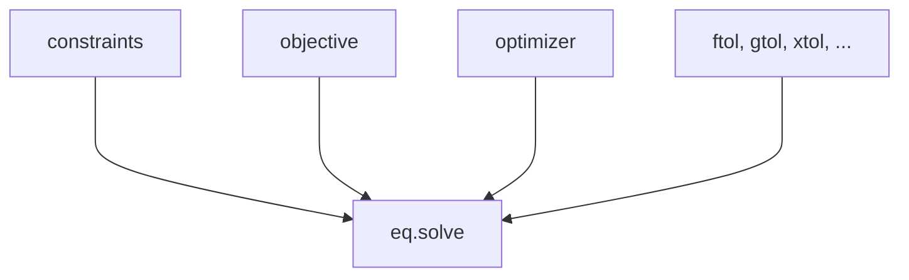
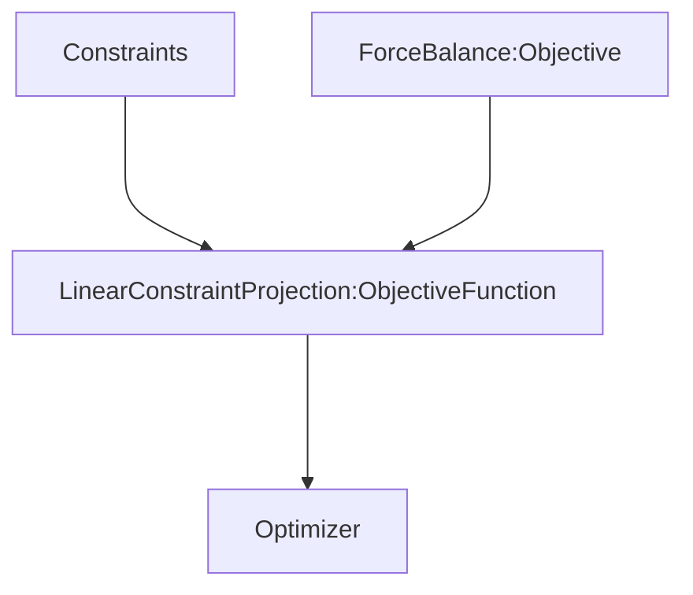
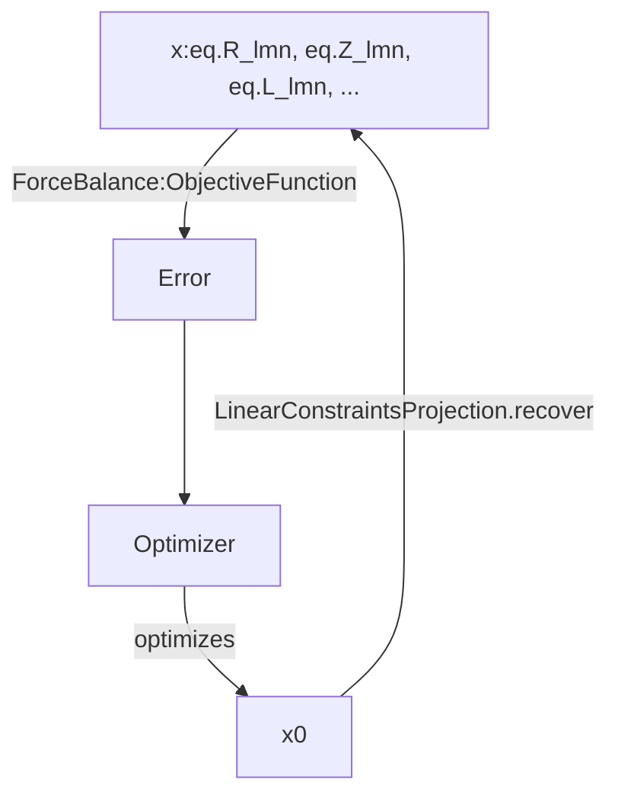

# Construction of equilibrium

```mermaid
flowchart TD
    surf[surf:FourierRZToroidalSurface] ---> eq[eq:Equilibrium]
    pres[pres:PowerSeriesProfile] ---> eq
    iotap[iota:PowerSeriesProfile]--->eq
    eq ---> basises[eq.R_basis, eq.Z_basis, eq.L_basis]
    ChebyshevZernikeBasis ---> basises
    eq -- .set_init_guess, sets --> eq.axis
    axis[axis:FourierRZCurve] ---> eq.axis
    surfba[ChebyshevFourierSeries] ---> surf
    axisba[ChebyshevSeries] --> axis
    params[Other Paramters: L,M,N, ...] ---> eq
    eq ---> solve[eq.solve]
```

# Data flow during solve

```mermaid
flowchart TD
    constraints---> s[eq.solve]
    objective --->s
    optimizer --->s
    params[ftol, gtol, xtol, ...] --->s
```

```mermaid
flowchart TD
    objective[ForceBalance:Objective]
    opt[Optimizer]
    Constraints---> lp[LinearConstraintProjection:ObjectiveFunction]
    objective ---> lp
    lp ---> opt
```

```mermaid
flowchart TD
    x[x:eq.R_lmn, eq.Z_lmn, eq.L_lmn, ...]
    x0
    x0 -- LinearConstraintsProjection.recover --> x
    x -- ForceBalance:ObjectiveFunction --> Error
    Error ---> Optimizer
    Optimizer -- optimizes --> x0
```

x -- LinearConstraintsP.project -->x0